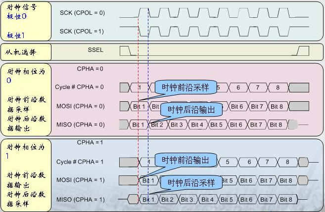

# SPI

## 软件基础

在设备树中每一个spi节点对应一个SPI控制器(一般情况下软件将bus和控制器配置成如下对应关系)

	spi0 <==> bus 0
	spi1 <==> bus 1
	spi2 <==> bus 2

其中每个SPI控制器上片选数有一个或多个,具体看芯片

	SPI0_CSN0
	SPI0_CSN1

	SPI1_CSN0

	SPI2_CSN0
	SPI2_CSN1

## SPI工作方式

SPI以主从方式工作,这种模式通常有一个主设备和一个或多个从设备,需要至少4根线

	CS			片选信号
	SCLK		时钟信号
	MOSI		主设备数据输出,从设备数据输入
	MISO		主设备数据输入,从设备数据输出

Linux内核用CPOL和CPHA的组合来表示当前SPI的四种工作模式

	CPOL＝0,CPHA＝0		SPI_MODE_0
	CPOL＝0,CPHA＝1		SPI_MODE_1
	CPOL＝1,CPHA＝0		SPI_MODE_2
	CPOL＝1,CPHA＝1		SPI_MODE_3

CPOL:表示时钟信号的初始电平的状态,０为低电平,１为高电平

CPHA:表示在哪个时钟沿采样,０为第一个时钟沿采样,１为第二个时钟沿采样

SPI的四种工作模式波形图如下

## 硬件连接(以W25Q128FV为例子介绍)

	CS		<--> 	SPI1_CSN0
	VCC		<--> 	VCC3V3_SYS
	DO		<--> 	SPI1_RXD
	DI		<--> 	SPI1_TXD
	GND		<--> 	GND
	HOLD	<--> 	TP_RST(需要拉高到3V)
	CLK 	<--> 	SPI1_CLK

## DeviceTree

	&spi1 {
		status = "okay";
		max-freq = <48000000>;
		dev-port = <1>;

		w25q128fv@10{
			status = "okay";
			compatible = "firefly,w25q128fv";
			reg = <0x0>;
			spi-max-frequency = <48000000>;
		};
	};

dev-port

	表示bus_num,因为这里用的是spi1,所以配置为1

@10的含义

	1表示bus_num,需要和dev-port一致, 0表示spi设备使用CSN0作为片选

reg = <0x0>

	表示spi设备使用的片选,需要和上面一致,即CSN0
