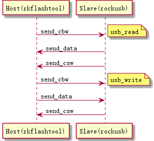

# USB

## Bulk-Only传输协议

设备插入到USB后,USB即对设备进行搜索,并要求设备提供相应的描述符.在USBHost得到上述描述符后,即完成了设备的配置,识别出为Bulk-Only的Mass Storage设备,然后即进入Bulk-Only传输方式
在此方式下,USB与设备间的所有数据均通过Bulk-In和Bulk-Out来进行传输,不再通过控制端点传输任何数据

在这种传输方式下,有三种类型的数据在USB和设备之间传送,CBW、CSW和普通数据.

CBW(Command Block Wrapper,即命令块包)是从USB Host发送到设备的命令, 命令格式遵从接口中的bInterfaceSubClass 所指定的命令块,可以是为SCSI或是自定义传输命令集

USB设备需要将SCSI(自定义的)命令从CBW中提取出来,执行相应的命令,完成以后,向Host发出反映当前命令执行状态的CSW(Command Status Wrapper),Host根据CSW来决定是否继续发送下一个CBW或是数据

Host要求USB设备执行的命令可能为发送数据,则此时需要将特定数据传送出去,完毕后发出CSW,以使Host进行下一步的操作

CBW数据结构如下

	struct fsg_bulk_cb_wrap {
		__le32	Signature;		/* Contains 'USBC' */
		u32	Tag;			/* Unique per command id */
		__le32	DataTransferLength;	/* Size of the data */
		u8	Flags;			/* Direction in bit 7 */
		u8	Lun;			/* LUN (normally 0) */
		u8	Length;			/* Of the CDB, <= MAX_COMMAND_SIZE */
		u8	CDB[16];		/* Command Data Block */
	};

CSW数据结构如下

	struct bulk_cs_wrap {
		__le32	Signature;		/* Should = 'USBS' */
		u32	Tag;			/* Same as original command */
		__le32	Residue;		/* Amount not transferred */
		u8	Status;			/* See below */
	};

各字段含义

Signature

	固定值: 字符串'USBC'

Tag

	主机发送的一个命令块标识，设备需要原样作为dCSWTag（CSW中的一部分）再发送给Host;主要用于关联CSW到对应的CBW

FLags

	反映数据传输的方向,0表示来自Host, 1表示发至Host

Lun

	 对于有多个LUN逻辑单元的设备,用来选择具体目标.如果没有多个LUN,则写0

Length

	命令的长度,范围在0~16

CDB

	传输的具体命令,符合bInterfaceSubClass中定义的命令规范

Residue

	还需要传送的数据,此数据根据dCBWDataTransferLength本次已经传送的数据得到

Status

	指示命令的执行状态.如果命令正确执行,bCSWStatus返回0 即可

## 应用实例

[HOST端软件代码rkflashtool](https://github.com/54shady/rkflashtool)

[SLAVE端软件代码rockusb](./cmd_rockusb.c)

数据通信流程简图

Host端代码

使用libusb库进行usb通讯,大致流程如下

初始化,设置调试级别,使用vid,pid打开设备,连接设备,获取设备通讯接口,获取描述符

    libusb_init
    libusb_set_debug
	libusb_open_device_with_vid_pid
    libusb_kernel_driver_active
    libusb_claim_interface
    libusb_get_device_descriptor

控制传输接口

	libusb_control_transfer

bulk传输接口

    libusb_bulk_transfer

Slave端

进入下载模式后会枚举成为MassStroage

循环等待接收命令,处理命令,具体见代码注释
